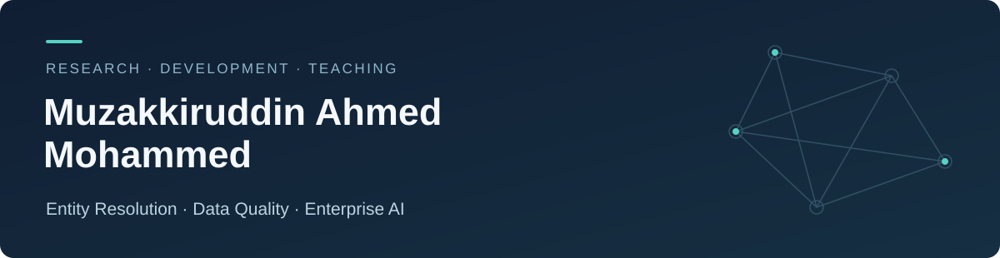

  

  <a href="https://www.linkedin.com/in/muzakkiruddin-ahmed-mohammed-540422171/">LinkedIn</a> ·
  <a href="#selected-projects">Projects</a> ·
  <a href="https://scholar.google.com/citations?user=r8MAktAAAAAJ&amp;hl=en">Google Scholar</a> ·
  <a href="#selected-publications">Publications</a> ·
  <a href="#teaching--collaboration">Teaching &amp; collaboration</a>

## Researcher, AI developer & instructor

I am pursuing a **Ph.D. in Computer and Information Science at the University of Arkansas at Little Rock**, where I serve as a Graduate Research Assistant and Lead AI Developer for an AI-assisted Entity Resolution framework. My research explores multi-LLM ensembles for record linkage and master data management in collaboration with **PiLog Group**.

I build intelligent data pipelines that connect generative AI with data quality: extracting information from industrial catalogs, resolving records, evaluating clusters, and preserving the evidence behind each result.

### Areas of focus

- **Entity resolution & master data management** — record linkage, multi-LLM ensembles, local model integration, and cluster comparison metrics.
- **Agentic data quality & governance** — validation, adaptive monitoring, analytical dashboards, and enterprise data workflows.
- **Document AI & enterprise knowledge** — LLMs, vision-language models, AI agents, and retrieval-augmented generation for industrial information.

## Selected publications

My publications cover entity resolution, multi-agent systems, industrial information extraction, and data governance.

| Paper | Venue |
| :--- | :--- |
| [Privacy-Preserving Structured Knowledge Extraction from Census-Style Records Using a Hierarchical Multi-Agent Open-Weight LLM Architecture](https://doi.org/10.3390/knowledge6030023) · [Code](https://github.com/MohdMuzakkiruddinAhmed/census-pii-agents) | *Knowledge*, 2026 |
| [Case count metric for comparative analysis of entity resolution results](https://doi.org/10.3389/fdata.2026.1736939) · [Code](https://github.com/MohdMuzakkiruddinAhmed/CCMS) | *Frontiers in Big Data*, 2026 |
| [Multilingual Customer Record Linkage: A Novel Approach Using LLMs for Cross-Lingual Entity Resolution](https://doi.org/10.1007/978-3-032-22196-4_29) | Springer, online 2026; volume 2027 |
| [Multi-Agent RAG Framework for Entity Resolution: Advancing Beyond Single-LLM Approaches with Specialized Agent Coordination](https://doi.org/10.3390/computers14120525) | *Computers*, 2025 |
| [Retrieval-Augmented Multi-LLM Ensemble for Industrial Part Specification Extraction](https://doi.org/10.1109/KSE68178.2025.11309590) | IEEE KSE, 2025 |
| [Policy-Aware Generative AI for Safe, Auditable Data Access Governance](https://doi.org/10.1109/KSE68178.2025.11309632) | IEEE KSE, 2025 |

**[View all 16 works and full author lists](https://github.com/MohdMuzakkiruddinAhmed/MohdMuzakkiruddinAhmed/blob/main/PUBLICATIONS.md)** · [BibTeX](https://github.com/MohdMuzakkiruddinAhmed/MohdMuzakkiruddinAhmed/blob/main/publications.bib) · [Google Scholar](https://scholar.google.com/citations?user=r8MAktAAAAAJ&hl=en)

## Selected projects

| Project | What you can explore |
| :--- | :--- |
| **[Recursive ER Research Artifact](https://github.com/MohdMuzakkiruddinAhmed/Recursive-ER-Research-Artifact)** | Recursive co-occurrence blocking and graph clustering, with a manuscript, experiment evidence, and a synthetic example. |
| **[Adaptive Data Quality](https://github.com/MohdMuzakkiruddinAhmed/adaptive-data-quality)** | Drift detection, adaptive thresholds, and selective validation for evolving data batches. |
| **[Multilingual Industrial Data Refinery](https://github.com/MohdMuzakkiruddinAhmed/multilingual-industrial-data-refinery)** | Evidence-linked motor-catalog refinement, multilingual synthetic benchmarks, and deterministic validation. |
| **[Census PII Agents](https://github.com/MohdMuzakkiruddinAhmed/census-pii-agents)** | A hierarchical multi-agent approach to structured extraction, with local and cloud backend options and mocked tests. |
| **[CCMS — Case Count Metric System](https://github.com/MohdMuzakkiruddinAhmed/CCMS)** | Interpretable comparison of entity-resolution clusterings through Python, a web interface, and SQL. |
| **[Industrial Catalog Extractor](https://github.com/MohdMuzakkiruddinAhmed/Industrial-Catalog-Extractor)** | A document VLM-to-RAG pipeline with source-grounded product records, citation validation, and an offline demo. |

Each repository documents its scope, setup, and limitations. Research results should be interpreted within the datasets and evaluation conditions reported by the project.

## Teaching & collaboration

**CDOIQ Program · Instructor & Researcher** 
I contribute to the Agentic Data Quality (ADQ) Certificate Program, including research and educational content on Agentic Data Quality Architecture and **CDOIQGPT**, an enterprise knowledge assistant built with open-source LLMs and RAG.

**UA Little Rock · NVIDIA Academic Grant initiative · Project Collaborator** 
I support GPU-accelerated AI infrastructure for research and education and develop enterprise AI demonstrations involving LLMs, multi-agent systems, data quality, and governance.

My work with **Dr. John Talburt** has also included locally deployed LLMs for entity resolution, cluster-comparison metric systems, and interactive dashboards for data quality analysis.

---

Interested in entity resolution, agentic data quality, or enterprise AI? [Connect with me on LinkedIn](https://www.linkedin.com/in/muzakkiruddin-ahmed-mohammed-540422171/).
